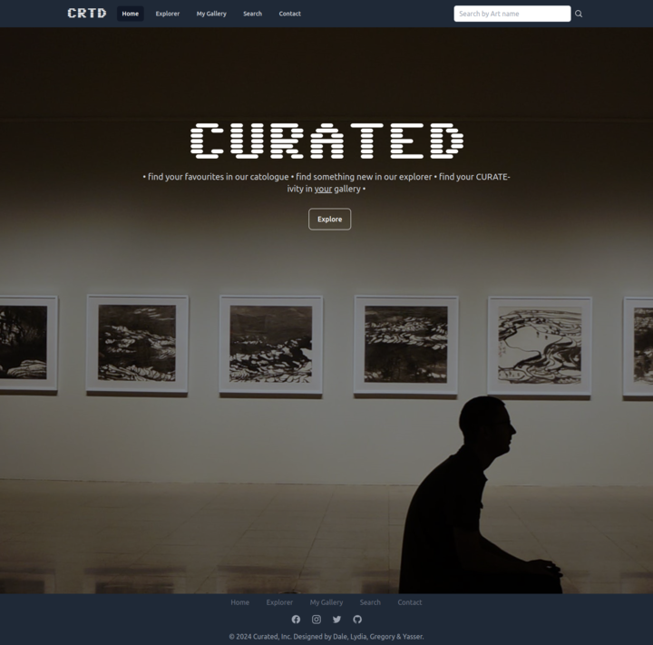

# Curated

The aim of this project is to engineer a React JS front end application that solves a real-world problem by integrating data received from server-side API requests. This project aims to bring developers to work collaboratively, using agile development methodologies and implement feature and bug fixes using git branch workflow and pull requests.

## Functionality

The Team has worked on a Art Explorer App, where a user can search for a peice of art using the explorer, and can also save favorite artworks in the my gallery section. The full functionality of the APP is listed below:

* The user can search by a a peice by searching through a number of unique titles.
* The user will be presented with a number of similar peices of art based on the unique title selected.
* The user can add the selected artwork to my gallery by clicking 'save to my gallery'
* The user can search for specific artwork by artist name/year in the search artwork section
* The user can use the search function in the navigation bar to search for artwork by key word criteria
* The user can contact the Curated team on the contact page.

## Tech Stack

The list of the Tech Stack used in developing the APP are below:

* Request to [HARVARD API](https://api.harvardartmuseums.org) to get the art API
* Tailwind, Headlessui, Heroicons
* ReactJS, React Slick & React Lazyload
* HTML5, CSS3 and JavaScript

## Collaborators

* [Dale Warburton](https://github.com/Dezmondo7)
* [Gregory Oghenah](https://github.com/kenigreg)
* [Lydia Barham](https://github.com/lydiabarham)
* [Yasser Rezvani](https://github.com/yrezvani)

## Mock-Up

The following image shows the web application's appearance and functionality: 

## Presentation

The link to the presentation slides can be found https://www.canva.com/design/DAF8tAL-UEE/ue0k0Z_zpn6Sce_Cwyy6YA/view?utm_content=DAF8tAL-UEE&utm_campaign=designshare&utm_medium=link&utm_source=editor 

## Deployment

The application is deployed live at the following 

